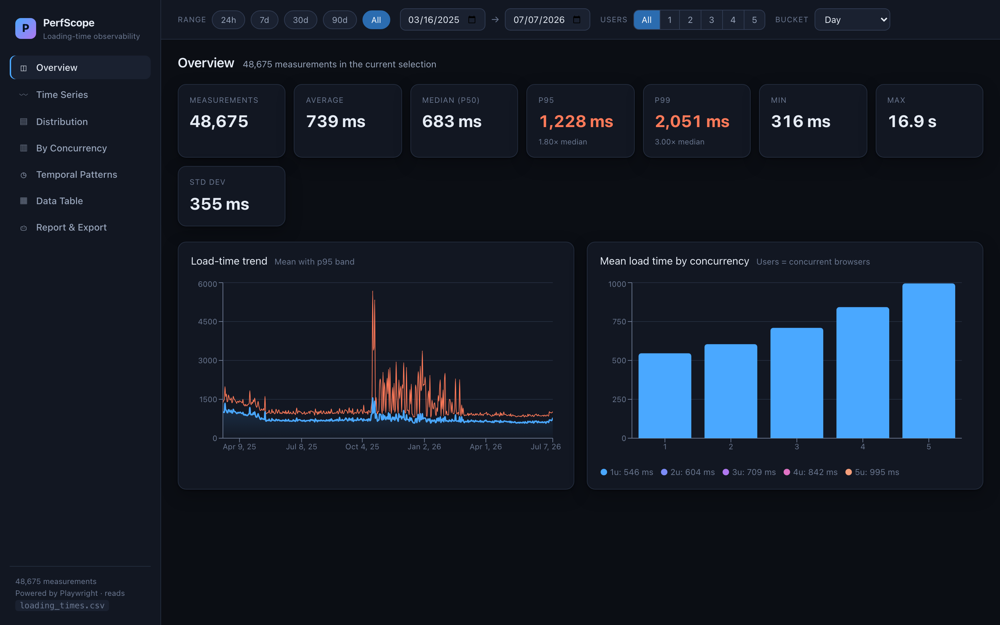
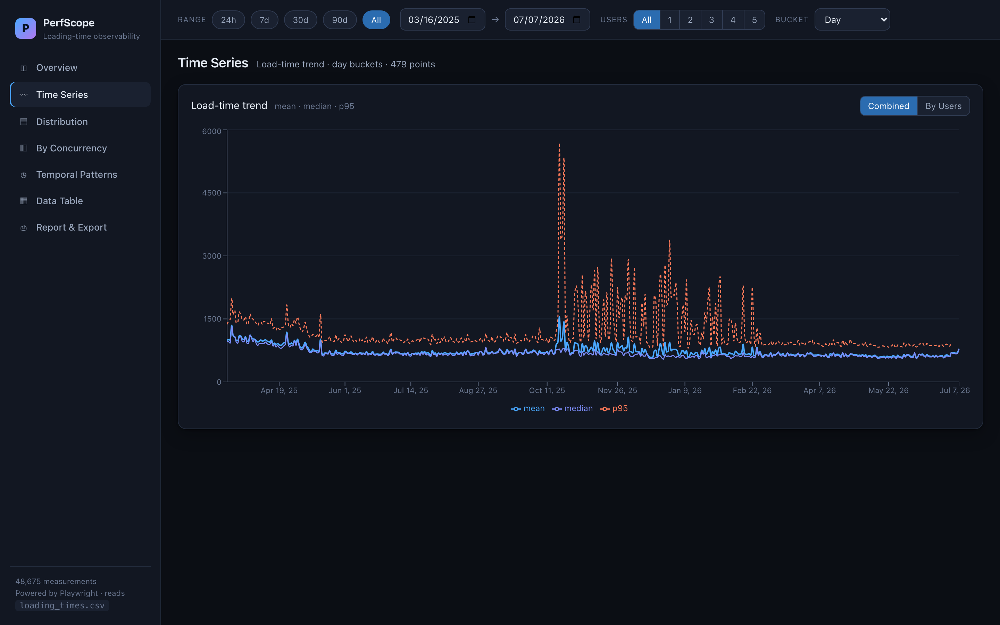
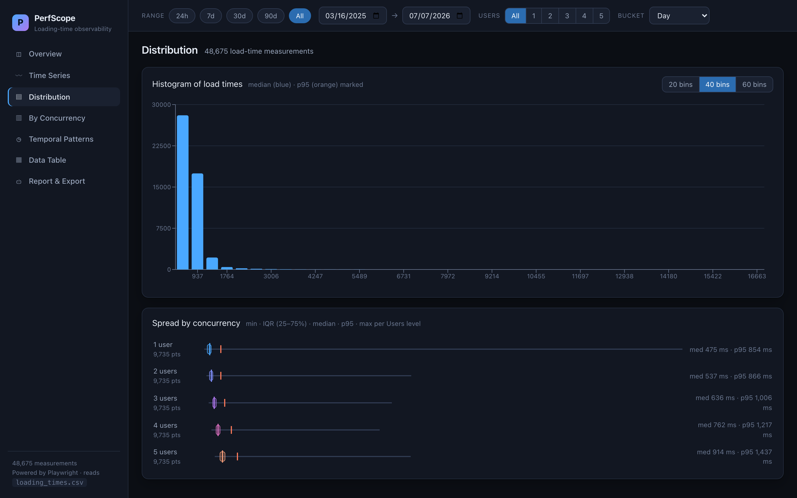
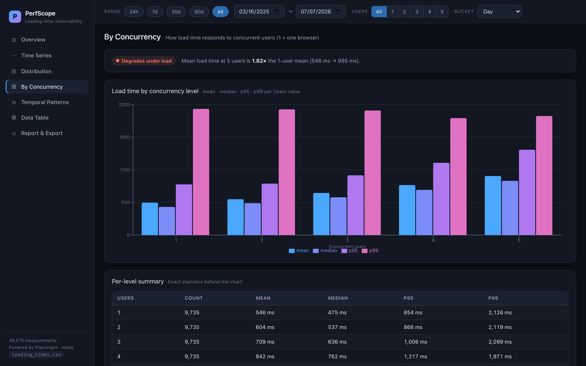
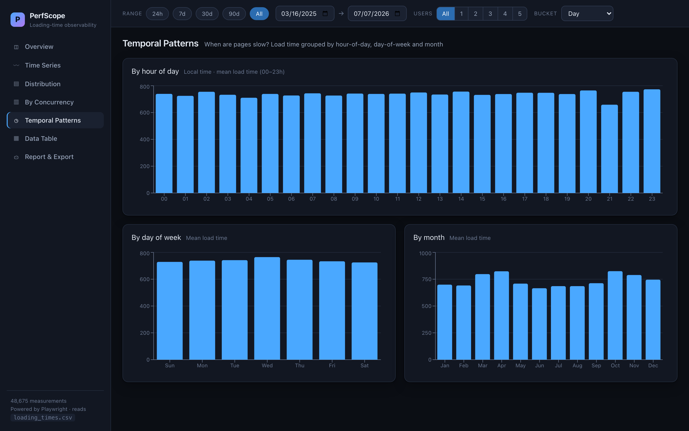
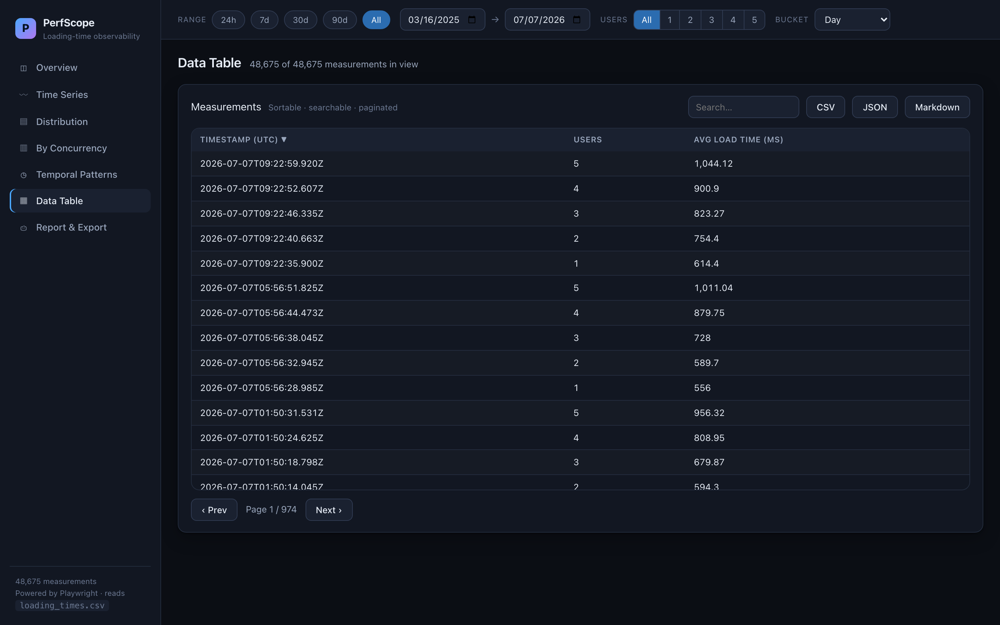
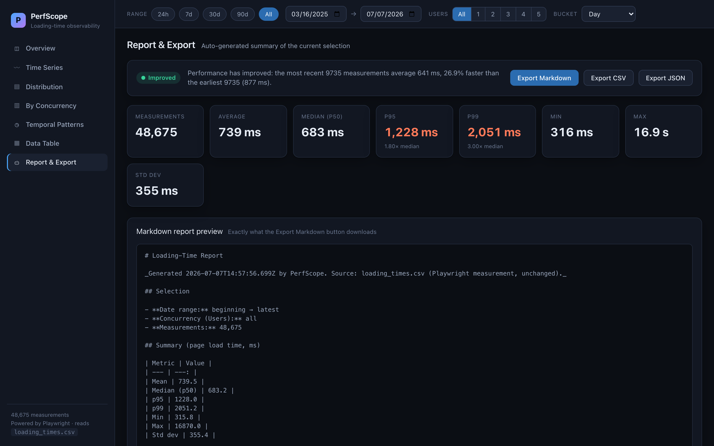

# PerfScope — Loading-Time Observability Dashboard

**Live browser performance observability dashboard powered by Playwright.**

PerfScope is a modern, filterable dashboard that turns this repo's
`loading_times.csv` — the append-only log produced by the existing Playwright
measurement script — into a rich, explorable view of page-load performance over
time.

> **Additive by design.** This dashboard lives entirely in the `dashboard/`
> subfolder. It does **not** change how measurements are collected and does
> **not** modify any existing file: the Playwright script, `loading_times.csv`,
> the notebooks, `app.R`, and the existing GitHub Actions all stay exactly as
> they were. The dashboard only reads the CSV and changes how the data is
> *displayed*.

---

## What it does

- Reads the repo's `loading_times.csv` (`Timestamp, Users, Avg_Loading_Time`) —
  the same measurements, unchanged.
- Presents seven views over that data with a shared global filter bar:
  **Overview · Time Series · Distribution · By Concurrency · Temporal Patterns ·
  Data Table · Report & Export**.
- Live statistics — count, mean, median, p95, p99, min, max, std — that
  recompute as you filter.
- Exports the current filtered selection as **CSV / JSON / Markdown** (with a
  stable/improved/degraded interpretation line).

## Why it matters

The measurement script already collects a valuable time series (tens of
thousands of concurrent-load samples going back many months). Raw CSV and static
notebooks make that hard to explore interactively. PerfScope makes the same data
*answerable*: how does load time respond to concurrency? when in the day is it
slow? is performance drifting? — all without touching the collection pipeline,
and deployable as a static site to GitHub Pages.

---

## Screenshots

| Overview | Time Series |
| --- | --- |
|  |  |

| Distribution | By Concurrency |
| --- | --- |
|  |  |

| Temporal Patterns | Data Table |
| --- | --- |
|  |  |

| Report & Export |
| --- |
|  |

---

## Install & run

Prerequisites: **Node.js ≥ 20**.

```sh
cd dashboard
npm install
npm run dev       # http://localhost:5173  (copies loading_times.csv first)
```

That's it. `npm run dev` runs a `predev` step that copies the repo-root
`loading_times.csv` into `public/data/` (read-only) and starts Vite with
hot-reload.

### Build a static bundle

```sh
npm run build     # output in dashboard/dist/
npm run preview   # serve the built bundle locally
```

### Refresh the data snapshot

The dashboard reads a copy of the CSV. To pull the latest from the repo root:

```sh
npm run copy-data
```

### Docker

```sh
# from the repo root
docker build -f dashboard/Dockerfile -t perfscope .
docker run --rm -p 8080:80 perfscope      # http://localhost:8080
# or
docker compose -f dashboard/docker-compose.yml up --build
```

---

## Running the underlying measurement (unchanged)

The dashboard visualizes data produced by the existing script at the repo root.
That workflow is untouched; to collect more data, use it exactly as before:

```sh
# from the repo root (see the top-level README)
ts-node measureLoadingTime.spec.ts
```

New rows appended to `loading_times.csv` show up in the dashboard on the next
`npm run copy-data` / build.

---

## Deploy to GitHub Pages

A ready-to-use workflow is included at
`.github/workflows/dashboard-pages.yml`. In your repo settings, set
**Settings → Pages → Source = GitHub Actions**. On the next push to `main` (or a
manual dispatch) it builds with the correct base path (`/<repo-name>/`) and
publishes `dashboard/dist`. Because the build re-copies `loading_times.csv`, the
published dashboard refreshes whenever the hourly measurement action commits new
data.

---

## How it works

- **Stack:** Vite + React + TypeScript, Recharts for charts, PapaParse for CSV.
- **No backend:** everything runs client-side over the CSV.
- **Data model & internals:** see [docs/DESIGN.md](docs/DESIGN.md).

```
dashboard/
├── index.html
├── package.json
├── vite.config.ts
├── Dockerfile · docker-compose.yml
├── scripts/copy-data.mjs        # read-only copy of ../loading_times.csv
├── docs/DESIGN.md · docs/screenshots/
└── src/
    ├── main.tsx · App.tsx
    ├── lib/      types · data · stats · aggregate · histogram · exporters · chartTheme
    ├── hooks/    useFilters
    ├── components/ FilterBar · StatCards · Panel
    └── views/    Overview · TimeSeries · Distribution · Concurrency · Temporal · Table · Report
```

---

## Roadmap

- [ ] Per-URL comparison (once the measurement script logs the tested URL).
- [ ] Richer web-vitals (FCP, LCP, DOMContentLoaded, request/error counts) —
      requires the measurement layer to record them.
- [ ] Baseline pinning + automatic regression alerts when p95 exceeds a
      threshold.
- [ ] Annotations / deploy markers on the time-series.
- [ ] Shareable filter state via URL query params.
- [ ] Live streaming mode (SSE) for in-progress runs.

---

## Disclaimer

This dashboard is a visualization layer over an educational measurement project.
As noted in the top-level README, the underlying script uses
`https://google.com` solely as a stable test case for personal learning, making
a low and limited number of automated requests. The dashboard changes none of
that — it only reads and displays the resulting data.
